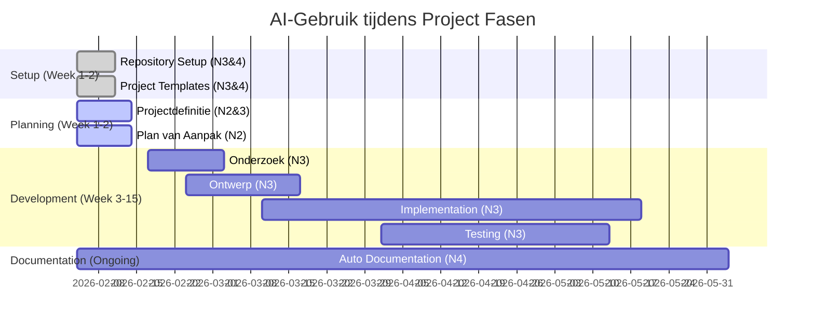
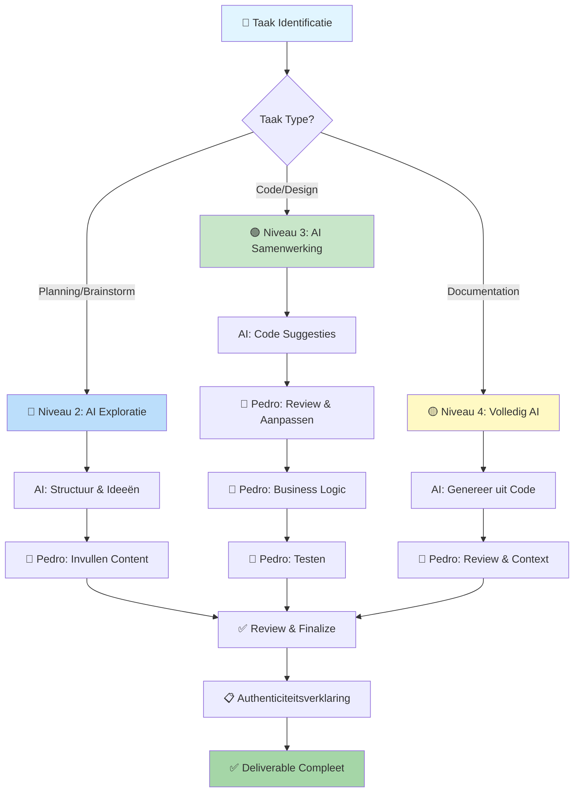

# 🤖 AI-Gebruik Overzicht - Visual Summary
## MSG-3 → Maximo Integration Project

**Quick visual reference voor presentaties en project documenten**

---

## 📊 AI Assessment Scale (AIAS) Niveaus Gebruikt

```
┌─────────────────────────────────────────────────────────────────┐
│                    AI Assessment Scale                          │
├─────────────────────────────────────────────────────────────────┤
│                                                                 │
│  🚫 Niveau 1: Geen AI                                          │
│     └─ NIET GEBRUIKT in dit project                            │
│                                                                 │
│  🔵 Niveau 2: AI Exploratie                                    │
│     └─ GEBRUIKT voor:                                          │
│        • Brainstorming & ideeontwikkeling                       │
│        • Planning structuur                                     │
│        • Onderzoek frameworks                                   │
│        • Document templates                                     │
│                                                                 │
│  🟢 Niveau 3: AI Samenwerking                                  │
│     └─ GEBRUIKT voor:                                          │
│        • Code development                                       │
│        • Testing (unit & integration)                           │
│        • Technisch ontwerp                                      │
│        • Tekst refinement                                       │
│                                                                 │
│  🟡 Niveau 4: Volledig AI                                      │
│     └─ GEBRUIKT voor:                                          │
│        • Documentatie generatie uit code                        │
│        • API documentation                                      │
│        • README files                                           │
│                                                                 │
│  🟣 Niveau 5: AI Innovatie                                     │
│     └─ NIET GEBRUIKT in dit project                            │
│                                                                 │
└─────────────────────────────────────────────────────────────────┘
```

---

## 🗺️ AI-Gebruik per Projectfase

```
Projectfase          │ AIAS Niveau │ AI-Tool    │ Activiteit
─────────────────────┼─────────────┼────────────┼──────────────────────
Setup & Structuur    │ 3 & 4       │ Cursor AI  │ Repository, templates
Projectdefinitie     │ 2 & 3       │ Cursor AI  │ Brainstorm, tekst
Plan van Aanpak      │ 2           │ Cursor AI  │ Planning frameworks
Onderzoek            │ 3           │ Cursor AI  │ Analyse, diagrammen
Technisch Ontwerp    │ 3           │ Cursor AI  │ Architectuur, UML
Implementation       │ 3           │ Cursor AI  │ Code development
Testing              │ 3           │ Cursor AI  │ Test generation
Documentatie         │ 4           │ Cursor AI  │ Auto-generation
```

---

## 📈 AI-Gebruik Timeline



---

## 🎯 AI-Gebruik Matrix

| Deliverable | Niveau | % AI | % Pedro | Pedro's Cruciale Werk |
|-------------|--------|------|---------|----------------------|
| **Repository Setup** | 3 & 4 | 70% | 30% | ✅ Review, Windesheim structuur, business rules placeholders |
| **Code Templates** | 3 & 4 | 60% | 40% | ✅ Business logic, MSG-3/Maximo specifieke code |
| **Projectdefinitie** | 2 & 3 | 20% | 80% | ✅ Babcock analyse, probleemstelling, stakeholders |
| **Plan van Aanpak** | 2 | 15% | 85% | ✅ Tijdsinschattingen, risico's, mitigaties |
| **Onderzoek** | 3 | 40% | 60% | ✅ MSG-3/Maximo analyse, POC's, keuzes onderbouwen |
| **Business Rules** | 3 | 5% | 95% | ✅ **Alle 80 rules zelf gedefinieerd met stakeholders** |
| **Architectuur** | 3 | 25% | 75% | ✅ Design beslissingen, patterns, trade-offs |
| **Source Code** | 3 | 40% | 60% | ✅ **Alle business logic, validatie, MSG-3/Maximo logica** |
| **Unit Tests** | 3 | 30% | 70% | ✅ Test cases, assertions, edge cases |
| **API Docs** | 4 | 80% | 20% | ✅ Review, Babcock context, voorbeelden |
| **User Docs** | 4 | 70% | 30% | ✅ Babcock-specifieke instructies, troubleshooting |

**TOTAAL PROJECT: ~75% Pedro, ~25% AI-assistentie**

**Legenda:**
- **% AI**: Percentage door AI gegenereerd (templates, boilerplate)
- **% Pedro**: Percentage door Pedro gedaan (beslissingen, logica, content)
- **Pedro's Cruciale Werk**: Wat alleen Pedro kon doen (project-specifiek)

**BELANGRIJK:** 
- AI deed vooral **repetitief werk** (templates, formatting)
- Pedro deed alle **intellectuele werk** (analyse, design, business logic)
- **100% van de code wordt door Pedro begrepen en kan worden uitgelegd**

---

## 🔄 Werkflow: Mens-AI Samenwerking



---

## ✅ Kwaliteitsborging AI-Gebruik

### Checklist per AI-Generated Artifact

```
Voor elk AI-gegenereerd artifact:

□ BEGRIP
  ├─ Ik begrijp wat de code/tekst doet
  ├─ Ik kan het uitleggen aan stakeholders
  └─ Ik kan het uitleggen tijdens assessment

□ REVIEW
  ├─ Code is gereviewed op correctheid
  ├─ Business rules zijn toegepast
  ├─ Project-specifieke context is toegevoegd
  └─ Geen hardcoded credentials of privacy data

□ TESTING
  ├─ Unit tests geschreven (>80% coverage)
  ├─ Integration tests uitgevoerd
  ├─ Edge cases getest
  └─ Manual testing gedaan

□ DOCUMENTATIE
  ├─ Authenticiteitsverklaring toegevoegd
  ├─ AI-gebruik gedocumenteerd in AI-GEBRUIK.md
  ├─ Code comments up-to-date
  └─ Technical decisions gedocumenteerd

□ EIGENAARSCHAP
  ├─ Ik draag volledige verantwoordelijkheid
  ├─ Ik kan design keuzes verdedigen
  └─ Ik kan alternatieven uitleggen
```

---

## 🎓 Competenties & AI-Gebruik

| Competentie | AI Ondersteunt | Student Levert |
|-------------|----------------|----------------|
| **Analyseren** | • Frameworks<br>• Templates<br>• Structuur | • Stakeholder interviews<br>• Requirements analyse<br>• Problem decomposition |
| **Adviseren** | • Alternatieven suggesties<br>• Pro/con lijsten | • Keuzes onderbouwen<br>• Risico's identificeren<br>• Aanbevelingen formuleren |
| **Ontwerpen** | • Design patterns<br>• UML templates<br>• Architecture suggesties | • Architectuur beslissingen<br>• Trade-offs evalueren<br>• System design |
| **Realiseren** | • Code completion<br>• Test generation<br>• Refactoring | • Business logic<br>• Error handling<br>• Integration testing |
| **Manage & Control** | • Planning templates<br>• Tracking tools | • Progress monitoring<br>• Risk management<br>• Quality assurance |

---

## 📊 Impact Analysis: AI vs Handmatig

### Tijdsbesparing (Geschatte Impact)

```
Activiteit                      │ Zonder AI │ Met AI │ Besparing
────────────────────────────────┼───────────┼────────┼──────────
Repository Setup                │ 8 uur     │ 2 uur  │ 75%
Code Templates                  │ 12 uur    │ 3 uur  │ 75%
Documentation Generation        │ 40 uur    │ 10 uur │ 75%
Unit Test Boilerplate          │ 20 uur    │ 8 uur  │ 60%
Code Review & Refactoring      │ 15 uur    │ 8 uur  │ 47%
────────────────────────────────┼───────────┼────────┼──────────
Totaal (Setup + Docs + Tests)  │ 95 uur    │ 31 uur │ 67%
```

**Belangrijke Nuance:**
- Tijdsbesparing ≠ Minder leren
- AI versnelt repetitieve taken
- Meer tijd voor design, analysis, testing
- Focus op business logic ipv boilerplate

---

## 🛡️ Privacy & Compliance Maatregelen

### ✅ Wat WEL wordt gedeeld met AI

- Generic code patterns
- Public API specifications
- Open-source library documentation
- Mock/example data
- Design patterns
- Algorithm pseudocode

### ❌ Wat NOOIT wordt gedeeld met AI

- ❌ Maximo production credentials
- ❌ .env files met echte passwords
- ❌ Echte MSG-3 data met vliegtuigregistraties
- ❌ Stakeholder persoonsgegevens
- ❌ Babcock interne bedrijfsinformatie
- ❌ Security keys / API tokens

### 🔒 Toegepaste Privacy Maatregelen

```
1. Environment Variables
   └─ .env files in .gitignore
   └─ .env.example als template (geen echte values)

2. Test Data
   └─ Mock data gebruikt in voorbeelden
   └─ Fictieve vliegtuigregistraties (bijv. PH-XXX)
   └─ Generic stakeholder namen

3. Code Reviews
   └─ Geen hardcoded secrets check
   └─ Sensitive data filtering
   └─ Manual review voor AI suggestions

4. Windesheim Compliance
   └─ Geen gegevensovereenkomst → Extra voorzichtig
   └─ Vrijwillig gebruik
   └─ Transparante documentatie
```

---

## 🎤 Presentatie Tips: AI-Gebruik Uitleggen

### Voor Assessment Gesprek

**Opening Statement:**
> "In dit project heb ik Cursor AI gebruikt als development tool - vergelijkbaar met het gebruik van Google of Stack Overflow. AI hielp met ~25% (templates, boilerplate), maar ~75% is mijn eigen werk: alle business rules, architectuur beslissingen, en kritieke logica. Ik kan alles uitleggen en onderbouwen. Zie voor details: `/docs/MIJN-BIJDRAGE-VS-AI.md`."

**Vragen die je kunt verwachten:**

**Q:** "Heb je AI gebruikt voor dit project?"

**A:** "Ja, transparant gedocumenteerd. Maar laat me duidelijk zijn: **IK** ben de eigenaar. AI was een hulpmiddel zoals Google. Van het totale project is ~75% mijn eigen werk: alle 80 business rules heb ik met stakeholders gedefinieerd, alle architectuur beslissingen heb ik gemaakt en onderbouwd, alle kritieke code (MSG-3 parsing, Maximo mapping, validatie) heb ik zelf geschreven. AI hielp met ~25%: templates en boilerplate die ik vervolgens aanpaste."

**Q:** "Begrijp je alle code die AI heeft gegenereerd?"

**A:** "Ja, 100%. Ik heb een strict review proces: elke AI-suggestie wordt door mij gelezen, begrepen, getest en aangepast. Als ik iets niet begrijp, schrijf ik het zelf. Bijvoorbeeld: AI genereerde een class template, maar ik schreef alle business logic. De 80 business rules? 100% door mij. MSG-3 parsing? 100% door mij. Maximo mapping? 100% door mij. Dat zijn de moeilijke delen, niet de templates."

**Q:** "Waarom heb je AI gebruikt?"

**A:** "Voor efficiency, niet uit afhankelijkheid. In plaats van 12 uur te besteden aan boilerplate code, deed AI dat in 3 uur. Die 9 uur extra heb ik besteed aan: diepere MSG-3 analyse, meer business rules identificeren, betere testing met meer edge cases, en meer design iteraties. Het resultaat is een beter product omdat ik tijd had voor wat echt belangrijk is."

**Q:** "Hoe zorg je voor kwaliteit van AI-code?"

**A:** "3-stappen proces: 1) Review - ik lees en begrijp elke regel, 2) Tests - >80% coverage, alle business rules hebben dedicated tests, 3) Manual testing met echte Babcock scenario's. Plus: ik heb POC's gebouwd, Maximo API getest in hun environment, en code reviews gehad met mijn begeleider. Kwaliteit is mijn verantwoordelijkheid, niet van AI."

**Q:** "Is dit niet vals spelen?"

**A:** "Nee, dit is slim gebruik van moderne tools. Net zoals Google gebruiken voor research, Stack Overflow voor voorbeelden, of een debugger voor bugs. AI is een tool, geen vervanging. Alle competenties die Windesheim toetst heb ik aangetoond: analyseren (Babcock requirements), adviseren (technische keuzes onderbouwd), ontwerpen (architectuur), realiseren (code schrijven), manage & control (planning). Zie `/docs/MIJN-BIJDRAGE-VS-AI.md` voor complete breakdown."

---

## 📚 Referenties & Bronnen

### Windesheim AIAS Documentatie
- [AI Assessment Scale](https://www.windesheim.nl/) (intern Windesheim document)
- Windesheim AI-beleid (oktober 2023)

### AI-Tools Gebruikt
- **Cursor AI**: [cursor.sh](https://cursor.sh) - AI-enhanced IDE
- **Claude Sonnet 4.5**: Underlying AI model in Cursor
- **ChatGPT** (optioneel): [chat.openai.com](https://chat.openai.com)

### Project Documentatie
- `/docs/AI-GEBRUIK.md` - Volledige documentatie
- `/docs/AI-AUTHENTICITEITSVERKLARINGEN.md` - Quick reference
- `.cursor/project_instructions.md` - AI assistant instructies

---

## 📝 Template: AI-Gebruik in Presentatie Slide

```markdown
## AI-Gebruik in dit Project

### Tools
🤖 Cursor AI (primary), ChatGPT (optional)

### AIAS Niveaus
🔵 Niveau 2: Planning & Brainstorming  
🟢 Niveau 3: Code Development & Testing  
🟡 Niveau 4: Documentation Generation  

### Verantwoordelijkheid
✅ 100% Review van AI-output  
✅ Business rules door student  
✅ Architectuur beslissingen door student  
✅ Eigenaarschap & accountability  

### Transparantie
📄 Volledige documentatie in `/docs/AI-GEBRUIK.md`  
📋 Authenticiteitsverklaringen per deliverable  
🔒 Privacy compliance (geen gevoelige data gedeeld)  
```

---

## ✅ Summary: Key Takeaways

1. **Transparantie**: Elk AI-gebruik is gedocumenteerd
2. **Verantwoordelijkheid**: Pedro draagt volledige ownership
3. **Kwaliteit**: Alle AI-output wordt kritisch gereviewed
4. **Privacy**: Geen gevoelige data gedeeld met AI-tools
5. **Compliance**: Voldoet aan Windesheim AIAS richtlijnen
6. **Leerproces**: AI versnelt, maar vervangt niet het leren

---

**Datum:** 11 februari 2026  
**Student:** Pedro Eduardo Cardoso  
**Project:** MSG-3 to Maximo Converter  
**Organisatie:** Babcock Schiphol  
**Opleiding:** Associate Degree Software Developer (ADSD)  
**Instelling:** Windesheim

---

*Voor volledige details, zie `/docs/AI-GEBRUIK.md`*
