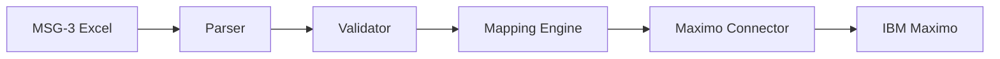
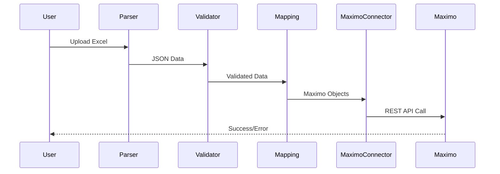

# 📚 Documentatie Overzicht
## MSG-3 → Maximo Integratie Project

---

Deze map bevat alle projectdocumentatie georganiseerd volgens de **Windesheim ADSD deliverables** en ondersteunende **technische documentatie**.

---

## 📁 Mappenstructuur

```
docs/
├── ZELFEVALUATIE-TRACKING.md         # 📊 ⭐ **LIVE SCORECARD** - Check ELKE VRIJDAG!
├── BEOORDELINGSCRITERIA.md           # 📋 Alle beoordelingscriteria
├── DELIVERABLES-CHECKLIST.md         # ✅ Wat moet er opgeleverd worden
├── AI-GEBRUIK.md                      # 🤖 Volledige AI-gebruik documentatie
├── AI-AUTHENTICITEITSVERKLARINGEN.md  # 📋 Quick reference verklaringen
├── MIJN-BIJDRAGE-VS-AI.md             # 🎯 Eigenaarschap bewijs
├── projectdefinitie/                  # Projectdefinitie & scope
├── plan-van-aanpak/                   # Planning & projectmanagement
├── onderzoek/                         # Technisch & functioneel onderzoek
├── technisch-ontwerp/                 # Architectuur & design
├── mapping/                           # MSG-3 ↔ Maximo mappings
├── testcases/                         # Testplannen & resultaten
├── overdracht/                        # Oplevering documentatie
└── readme-docs.md                     # Dit bestand
```

---

## 📊 ZELFEVALUATIE-TRACKING.md ⭐ **CHECK ELKE VRIJDAG!**

**Doel:** Live dashboard van je project - zie altijd waar je staat qua beoordeling

**Waarom dit je belangrijkste document is:**
- 🎯 **Geschat eindcijfer:** Real-time berekening (huidige: 7.2 verwacht)
- 📈 **Progress bars:** Per competentie (Analyseren 80%, Realiseren 30%, etc.)
- ✅ **Auto-updates:** Document wordt automatisch bijgewerkt bij nieuwe code/docs
- 📅 **Versie tracking:** Week 2 → Week 4 → Week 8 → Week 13 → Week 18
- ⚠️ **Early warnings:** Rode vlaggen als competentie < 6.0
- 💡 **Actie items:** Wat moet je DEZE WEEK doen?

**Inhoud:**
1. **Dashboard** - Overall score + per competentie
2. **Detailed tracking** - Elke competentie met:
   - Huidige score vs Geschat eind
   - Progress percentage (visueel)
   - Bewijsmateriaal tabel (LIVE links)
   - Complexiteit beschrijving
   - Update triggers (wanneer score verandert)
3. **Professional Skills** - Alle 7 skills getracked
4. **Versie geschiedenis** - Week 2, 4, 8, 13, 18 milestones
5. **Auto-update regels** - Voor AI Assistant
6. **Risico's** - Waar moet je op letten?

**Hoe te gebruiken:**
1. **Elke vrijdag:** Open dit document tijdens je weekly review
2. **Check je cijfer:** Zit je nog op 7.2? Of gedaald/gestegen?
3. **Prioriteiten:** Welke competentie heeft deze week aandacht nodig?
4. **Planning:** Wat moet volgende week af om op schema te blijven?

**💡 Weekly Review Routine:**
```markdown
Vrijdag 15:00 - Weekly Review
1. Open ZELFEVALUATIE-TRACKING.md
2. Check "Overall Score Prediction" → Nog steeds 7.2?
3. Check "Competentie Progress Overview" → Welke bars zijn gegroeid?
4. Check "Versie Geschiedenis" → Ben ik op schema voor volgende milestone?
5. Check "Risico's" → Rode vlaggen?
6. Update planning voor volgende week
```

**Zie:** [ZELFEVALUATIE-TRACKING.md](ZELFEVALUATIE-TRACKING.md)

---

## 📊 BEOORDELINGSCRITERIA.md ⭐ **START HIER!**

**Doel:** Alle beoordelingscriteria uit het officiële beoordelingsformulier Comaker 1 ADSD

**Waarom dit het belangrijkste document is:**
- 🎯 Weet PRECIES waar je op beoordeeld wordt
- ✅ Check bij elk document welke competenties je afdekt
- 📋 Voorkomt dat je dingen vergeet
- 🔗 Gekoppeld aan je deliverables

**Inhoud:**
1. **HBO-I Competenties** (5 competenties, elk met 4 beoordelingsaspecten)
   - Analyseren (Niveau 1)
   - Adviseren (Niveau 1)
   - Ontwerpen (Niveau 1)
   - Realiseren (Niveau 2) ⚡ **Hogere eis!**
   - Manage & Control (Niveau 1)

2. **Professional Skills** (4 hoofdcategorieën)
   - Persoonlijk Leiderschap
   - Toekomstgericht Organiseren
   - Onderzoekend Probleemoplossend
   - Doelgericht Interacteren

3. **Bewijs Mapping** 
   - Welke deliverables bewijzen welke competenties
   - Concrete voorbeelden uit jouw project
   - Status overzicht per competentie

**Hoe te gebruiken:**
1. Open dit document VOORDAT je een deliverable schrijft
2. Check welke beoordelingscriteria relevant zijn
3. Schrijf je document met die criteria in gedachten
4. Verwijs in je document naar concrete voorbeelden die criteria bewijzen
5. Update de status na voltooiing

**💡 Gouden regel:** 
> "Kan ik aan de hand van dit document aantonen dat ik aan een beoordelingscriterium voldoe?"

**Zie:** [BEOORDELINGSCRITERIA.md](BEOORDELINGSCRITERIA.md)

---

## ✅ DELIVERABLES-CHECKLIST.md

**Doel:** Overzicht van alle deliverables die opgeleverd moeten worden

**Inhoud:**
- Status per deliverable (✅ Compleet, 🔄 In Progress, ❌ Te doen)
- Locatie van bestanden
- Planning en deadlines
- Aanbevolen mappenstructuur voor oplevering
- Pre-oplevering checklist

**Workflow:**
1. Check DELIVERABLES-CHECKLIST: wat moet ik maken?
2. Check BEOORDELINGSCRITERIA: aan welke criteria moet het voldoen?
3. Schrijf document met beide in gedachten
4. Update beide documenten na voltooiing

**Zie:** [DELIVERABLES-CHECKLIST.md](DELIVERABLES-CHECKLIST.md)

---

## 🤖 AI-Documentatie (BELANGRIJK!)

### MIJN-BIJDRAGE-VS-AI.md ⭐ **LEES DIT EERST!**
**Doel:** Duidelijk maken wat IK (Pedro) heb gedaan vs wat AI deed

**Inhoud:**
- Gedetailleerd overzicht: 75% eigen werk, 25% AI-assistentie
- Per activiteit: Wat deed Pedro? Wat deed AI?
- Eigenaarschap bewijs (ik kan alles uitleggen)
- Assessment Q&A voorbeelden
- Analogie: AI als hulpmiddel (zoals Google)
- Competentie aantoning per aspect

**Waarom belangrijk?**
- ✅ Bewijst dat DIT MIJN PROJECT is
- ✅ Duidelijk dat AI een TOOL was, geen medeauteur
- ✅ Voorbereiding voor assessment vragen
- ✅ Toont dat ik alles begrijp en kan verdedigen

### AI-GEBRUIK.md
**Doel:** Volledige verantwoording van AI-gebruik conform AIAS (AI Assessment Scale)

**Inhoud:**
- Gebruikte AI-tools (Cursor AI, ChatGPT, etc.)
- AI-gebruik per projectfase met AIAS-niveaus
- Authenticiteitsverklaringen per deliverable
- Reflectie op AI-gebruik
- Privacy & compliance
- Balans mens-AI (met percentages)

**Waarom belangrijk?**
- ✅ Verplichte transparantie volgens Windesheim richtlijnen
- ✅ Voorkomt fraude-beschuldigingen
- ✅ Toont kritische evaluatie van AI-output
- ✅ Demonstreert eigenaarschap van werk

### AI-AUTHENTICITEITSVERKLARINGEN.md
**Doel:** Quick reference met copy-paste ready verklaringen

**Inhoud:**
- Overzichtstabel per deliverable
- 9 voorgeformuleerde authenticiteitsverklaringen
- Gebruik instructies
- Voorbeelden van plaatsing in documenten

**Hoe te gebruiken:**
1. Identificeer je deliverable type
2. Kopieer de bijbehorende verklaring
3. Plak onderaan je document
4. Pas aan indien nodig (meerdere tools, specifieke activiteiten)

---

## 📄 Deliverables per Map

### 1. Projectdefinitie (`projectdefinitie/`)
**Doel:** Context, probleemstelling en doelstellingen vastleggen

**Documenten:**
- `01-context-analyse.md` - Organisatie context (Babcock Schiphol)
- `02-probleemstelling.md` - Huidige situatie & pijnpunten
- `03-doelstellingen.md` - SMART doelen
- `04-scope.md` - In scope / out of scope
- `05-stakeholders.md` - Betrokken partijen

**Competentie:** Analyseren

---

### 2. Plan van Aanpak (`plan-van-aanpak/`)
**Doel:** Planning, aanpak en risico's documenteren

**Documenten:**
- `01-projectaanpak.md` - Methodiek (Agile/Scrum/Waterfall)
- `02-planning.md` - Tijdlijn, milestones, Gantt chart
- `03-risicoanalyse.md` - Risico's + mitigatie strategieën
- `04-randvoorwaarden.md` - Technische & organisatorische voorwaarden
- `05-deliverables.md` - Opleverpunten & acceptatiecriteria

**Competentie:** Manage & Control

---

### 3. Onderzoek (`onderzoek/`)
**Doel:** Technisch onderzoek en alternatieven evaluatie

**Documenten:**

#### Technisch Onderzoek
- `01-excel-parsing.md` - Onderzoek naar Excel parsing libraries
  - openpyxl vs pandas vs xlrd
  - Performance vergelijking
  - Keuze rationale
  
- `02-maximo-api.md` - Maximo integratie opties
  - REST API vs MIF vs MEA
  - Authentication mechanismen
  - Object Structures (PM, JobPlan, Locations)
  
- `03-change-detection.md` - Algoritmes voor wijzigingsdetectie
  - Hash-based comparison
  - Field-level diffing
  - Versioning strategieën

- `04-data-validation.md` - Validatie strategieën
  - Schema validation (JSON Schema, Pydantic)
  - Business rule validation
  - Error reporting

#### Functioneel Onderzoek
- `05-msg3-analyse.md` - Analyse MSG-3 structuur
  - ATA Chapters
  - Task types (Inspection, Lubrication, etc.)
  - Interval types (FH, FC, Calendar)
  
- `06-maximo-datamodel.md` - Maximo datamodel analyse
  - PM object structuur
  - JobPlan hierarchie
  - Relationships tussen objecten

**Competentie:** Analyseren, Adviseren

---

### 4. Technisch Ontwerp (`technisch-ontwerp/`)
**Doel:** Architectuur en gedetailleerd design

**Documenten:**
- `01-architectuur.md` - High-level architectuur
  - Component diagram
  - Deployment diagram
  - Technology stack
  
- `02-datamodellen.md` - Data structuren
  - MSG-3 JSON schema
  - Maximo object models
  - Internal data classes
  
- `03-api-specificaties.md` - API designs
  - Maximo REST API endpoints
  - Request/response formats
  - Error codes
  
- `04-class-diagram.md` - OOP design
  - Classes en interfaces
  - Relationships
  - Design patterns gebruikt
  
- `05-sequence-diagrams.md` - Flow diagrammen
  - Excel parsing flow
  - Validation flow
  - Maximo update flow
  
- `06-error-handling.md` - Error & exception handling strategie
- `07-security.md` - Security design (credentials, encryption)
- `08-performance.md` - Performance requirements & optimalisaties

**Competentie:** Ontwerpen

---

### 5. Mapping (`mapping/`)
**Doel:** Veld-voor-veld mapping MSG-3 ↔ Maximo

**Documenten:**
- `01-field-mapping-pm.md` - MSG-3 → Maximo PM object
  ```markdown
  | MSG-3 Veld | Type | Maximo PM Veld | Transformatie | Validatie |
  |------------|------|----------------|---------------|-----------|
  | Task Code  | str  | PMNUM          | Direct        | Required  |
  ```
  
- `02-field-mapping-jobplan.md` - MSG-3 → Maximo JobPlan
- `03-field-mapping-locations.md` - MSG-3 Zone → Maximo Location
- `04-transformatie-regels.md` - Business rules & transformaties
- `05-mapping-validatie.md` - Validatie regels per mapping
- `06-mapping-changelog.md` - Wijzigingen in mappings

**Competentie:** Ontwerpen, Realiseren

---

### 6. Testcases (`testcases/`)
**Doel:** Testplannen, scripts en resultaten

**Documenten:**
- `01-teststrategie.md` - Overall test aanpak
  - Unit testing
  - Integration testing
  - User acceptance testing
  
- `02-testplan-parser.md` - Test cases parser module
- `03-testplan-validator.md` - Test cases validator
- `04-testplan-mapping.md` - Test cases mapping engine
- `05-testplan-maximo-connector.md` - Test cases API connector
- `06-testplan-integration.md` - End-to-end scenarios
- `07-testdata.md` - Test data beschrijving
- `08-testresultaten.md` - Test runs & coverage reports

**Competentie:** Realiseren, Manage & Control

---

### 7. Overdracht (`overdracht/`)
**Doel:** Oplevering en kennisoverdracht

**Documenten:**
- `01-gebruikershandleiding.md` - How to use the system
  - Installatie instructies
  - Configuration
  - Excel file requirements
  - Running the application
  
- `02-technische-handleiding.md` - Voor developers
  - Code structure
  - Development setup
  - Testing procedures
  - Deployment
  
- `03-installatie-instructies.md` - Step-by-step deployment
- `04-troubleshooting.md` - Common issues & solutions
- `05-changelog.md` - Version history
- `06-toekomstige-verbeteringen.md` - Roadmap & recommendations
- `07-reflectie.md` - Persoonlijke reflectie Pedro
  - Wat ging goed
  - Wat kan beter
  - Geleerde lessen

**Competentie:** Alle competenties (afronding)

---

## 🎨 Documentatie Stijl

### Markdown Conventies
- Gebruik **heading hierarchy** (H1 voor titel, H2 voor secties, etc.)
- Gebruik **code blocks** met syntax highlighting
- Gebruik **Mermaid** voor diagrammen
- Gebruik **tables** voor gestructureerde data
- Gebruik **emojis** spaarzaam voor visual markers

### Mermaid Diagram Voorbeelden

#### Component Diagram


#### Sequence Diagram


---

## 📊 Documentatie Status

| Map / Document | Status | Laatste Update | Eigenaar |
|----------------|--------|----------------|----------|
| **ZELFEVALUATIE-TRACKING.md** ⭐⭐ | 🟢 Complete | 2026-02-11 | Pedro + AI |
| **BEOORDELINGSCRITERIA.md** ⭐ | 🟢 Complete | 2026-02-11 | Pedro |
| **DELIVERABLES-CHECKLIST.md** | 🟢 Complete | 2026-02-11 | Pedro |
| **MIJN-BIJDRAGE-VS-AI.md** | 🟢 Complete | 2026-02-11 | Pedro |
| **AI-GEBRUIK.md** | 🟢 Complete | 2026-02-11 | Pedro |
| **AI-AUTHENTICITEITSVERKLARINGEN.md** | 🟢 Complete | 2026-02-11 | Pedro |
| projectdefinitie | 🟡 In Progress | 2026-02-04 | Pedro |
| plan-van-aanpak | 🟡 In Progress | 2026-02-04 | Pedro |
| onderzoek | 🔴 Not Started | - | Pedro |
| technisch-ontwerp | 🟡 In Progress | 2026-02-11 | Pedro |
| mapping | 🔴 Not Started | - | Pedro |
| testcases | 🔴 Not Started | - | Pedro |
| overdracht | 🔴 Not Started | - | Pedro |

**Status Legend:**
- 🟢 Complete
- 🟡 In Progress
- 🔴 Not Started

---

## 🔄 Update Proces

1. **Bij nieuwe feature:**
   - Update `technisch-ontwerp/` met design
   - Update `mapping/` als er nieuwe mappings zijn
   - Update `testcases/` met nieuwe tests

2. **Bij bug fix:**
   - Document in `overdracht/05-changelog.md`
   - Update `troubleshooting.md` indien relevant

3. **Bij onderzoek:**
   - Voeg document toe in `onderzoek/`
   - Link vanuit `plan-van-aanpak/`

4. **Bij oplevering:**
   - Finaliseer alle documenten
   - Update status tabel hierboven
   - Review compleetheid met begeleider

---

## ✅ Checklist voor Assessment

### AI-Transparantie (VERPLICHT!)
- [x] AI-GEBRUIK.md compleet gedocumenteerd
- [x] Authenticiteitsverklaringen per deliverable toegevoegd
- [ ] Geen privacygevoelige data gedeeld met AI
- [ ] Alle AI-gegenereerde code gereviewed en begrepen
- [ ] Kan technische keuzes zelfstandig uitleggen

### Analyseren
- [ ] Context analyse compleet
- [ ] Probleemstelling duidelijk
- [ ] Requirements gedocumenteerd
- [ ] Stakeholder analyse uitgevoerd

### Adviseren
- [ ] Alternatieven onderzocht
- [ ] Technische keuzes onderbouwd
- [ ] Risico's geïdentificeerd
- [ ] Aanbevelingen gedocumenteerd

### Ontwerpen
- [ ] Architectuur diagram gemaakt
- [ ] Datamodellen gedefinieerd
- [ ] API's gespecificeerd
- [ ] Design patterns gedocumenteerd

### Realiseren
- [ ] Code geïmplementeerd
- [ ] Tests geschreven (>80% coverage)
- [ ] Documentatie gegenereerd
- [ ] Deployment getest

### Manage & Control
- [ ] Planning opgesteld
- [ ] Voortgang gerapporteerd
- [ ] Kwaliteit geborgd
- [ ] Risico's gemonitord

---

## 📞 Contact

Voor vragen over de documentatie, neem contact op met **Pedro**.

---

*Dit document wordt automatisch bijgewerkt door Cursor AI tijdens het project.*

*Laatste update: 11 februari 2026*  
*Auteur: Pedro Eduardo Cardoso - Associate Degree Software Developer (ADSD)*
